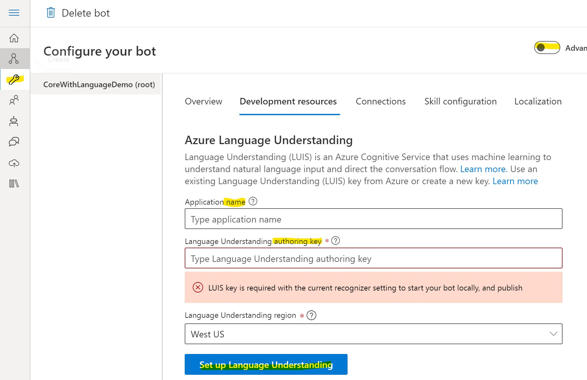
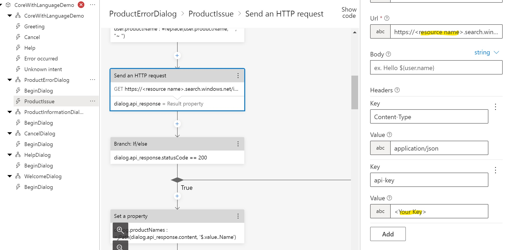
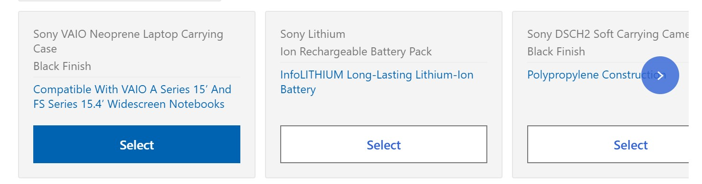
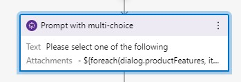
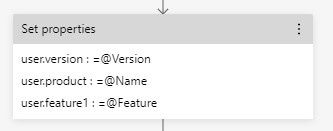
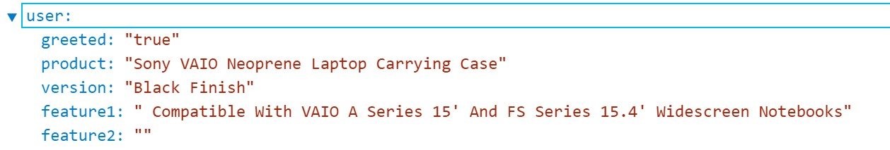

# Welcome to your new bot

This bot project was created using the Core Bot with Azure Language Understanding template, and contains support for a base set of conversational flows.

## Next steps

### Configuration

Luis and Cognitive Search need to be added. 
<br/> <br/>

- Set up LUIS. The screenshot below will show where these settings are located. You can also use the Advance settings to modify the json configuration file directly.
```
"luis": {
    "name": "",
    "authoringKey": ""
  },
  "qna": {
    "qnaRegion": "westus",
    "endpointKey": "",
    "subscriptionKey": ""
  }
```

- Create a cognitive search resource. I have added the products.json file to the repository, which is sample data.  
    - Under ProductErrorDialog -> ProductIssue -> Send an Http Requests . There are two requests. Add the **name of your resource** and the **api-key** in the header. 



- Set up Cogntive Search to [index the JSON file](https://docs.microsoft.com/en-us/azure/search/search-howto-index-json-blobs)
### Start building your bot

Composer can help guide you through getting started building your bot. From your bot settings page (the wrench icon on the left navigation rail), click on the rocket-ship icon on the top right for some quick navigation links.

Another great resource if you're just getting started is the **[guided tutorial](https://docs.microsoft.com/en-us/composer/tutorial/tutorial-introduction)** in our documentation.

### Connect with your users

Your bot comes pre-configured to connect to our Web Chat and DirectLine channels, but there are many more places you can connect your bot to - including Microsoft Teams, Telephony, DirectLine Speech, Slack, Facebook, Outlook and more. Check out all of the places you can connect to on the bot settings page.

### Publish your bot to Azure from Composer

Composer can help you provision the Azure resources necessary for your bot, and publish your bot to them. To get started, create a publishing profile from your bot settings page in Composer (the wrench icon on the left navigation rail). Make sure you only provision the optional Azure resources you need!

### Extend your bot with packages

From Package Manager in Composer you can find useful packages to help add additional pre-built functionality you can add to your bot - everything from simple dialogs & custom actions for working with specific scenarios to custom adapters for connecting your bot to users on clients like Facebook or Slack.

### Extend your bot with code

You can also extend your bot with code - simply open up the folder that was generated for you in the location you chose during the creation process with your favorite IDE (like Visual Studio). You can do things like create custom actions that can be used during dialog flows, create custom middleware to pre-process (or post-process) messages, and more. See [our documentation](https://aka.ms/bf-extend-with-code) for more information.


### Tidbits

#### Sample Bot Response with custom Adaptive Card
Prompt with multi-choice for an array of JSON properties. 


<br /> <br />

- Add Question for Mult-choice. Then Add the bot response. 
<br /> <br />

```
- ${foreach(dialog.productFeatures, item => json(submitActioncard(item.Name, item.Version, item.Feature)))}
```

>The dialog.productFeatures variable is JSON returned from a previous API call. 

##### Adaptive Card
```
# submitActioncard(name, version, feature)
- ```
{
    "$schema": "http://adaptivecards.io/schemas/adaptive-card.json",
    "type": "AdaptiveCard",
    "version": "1.3",
    "body": [
      {
            "type": "TextBlock",
            "text": "${name}",
            "wrap": true,
            "size": "Small",
            "isSubtle": true,
            "spacing": "Small"
        },
      {
            "type": "TextBlock",
            "text": "${version}",
            "wrap": true,
            "size": "Small",
            "isSubtle": true,
            "spacing": "Small"
        },
        {
            "type": "TextBlock",
            "text": "${feature}",
            "wrap": true,
            "size": "Small",
            "color": "Accent",
            "isSubtle": true,
            "height": "stretch",
            "weight": "Lighter",
            "separator": true
        },
        {
            "type": "Container",
            "spacing": "Small",
            "style": "emphasis",
            "separator": true,
            "selectAction": {
                "type": "Action.Submit"
            },
            "height": "auto",
            "isVisible": false
        },
        {
            "type": "ActionSet",
            "actions": [
                {
                    "type": "Action.Submit",
                    "title": "Select",
                    "data": {
                        "Name": "${name}",
                        "Version": "${version}",
                        "Feature": "${feature}"
                     }
                }
            ]
        }
      
    ],
    "minHeight": "175px"
}
Add 3 back ticks```
```
<br /> <br />

- Add the following code to the **User Input**
```
=turn.activity.value
```
<br /> <br />
- Add **Managed Properties** -> **Set Properties** to the flow, after **User Input**
<br /> <br />

<br /> <br />

Now you will see the properties populated in the bot response in the emulator under the user scope. 


### Resources

[Project Conversation Learner](https://www.microsoft.com/en-us/research/project/conversation-learner/)

Bot Composer
[Introduction](https://docs.microsoft.com/en-us/composer/introduction?tabs=v2x)

The key parts of the Bot Composer are the Dialogs, which have the User Inputs and Bot Responses in the left-hand menu. The Quickstart tutorials will help with gaining familiarity with the tool. [Click here](https://docs.microsoft.com/en-us/composer/quickstart-create-bot)

You can use templates to get started: [Click here](https://docs.microsoft.com/en-us/composer/templates/enterprise-assistant-overview)

There are several samples that you can use to develop various [components](https://github.com/microsoft/botbuilder-samples)


Bot Framework Adaptive Tools - [VS Code Extension](https://marketplace.visualstudio.com/items?itemName=BotBuilder.bot-framework-adaptive-tools)

Adaptive Expressions - [Prebuilt functions](https://docs.microsoft.com/en-us/azure/bot-service/adaptive-expressions/adaptive-expressions-prebuilt-functions?view=azure-bot-service-4.0#jPath)

[Also here](https://docs.microsoft.com/en-us/azure/bot-service/adaptive-expressions/adaptive-expressions-prebuilt-functions?view=azure-bot-service-4.0#conversion-functions)

[Testing Expressions](https://playgroundclient.azurewebsites.net)

**Adaptive Cards** 

[Samples](https://adaptivecards.io/samples/)
[Designer](https://adaptivecards.io/designer/)

**Cognitive Search** 
[Salesforce](https://docs.microsoft.com/en-us/azure/search/search-how-to-index-power-query-data-sources)
[Fuzzy Search](https://docs.microsoft.com/en-us/azure/search/search-query-fuzzy)
[Search Examples](https://docs.microsoft.com/en-us/azure/search/search-query-lucene-examples)